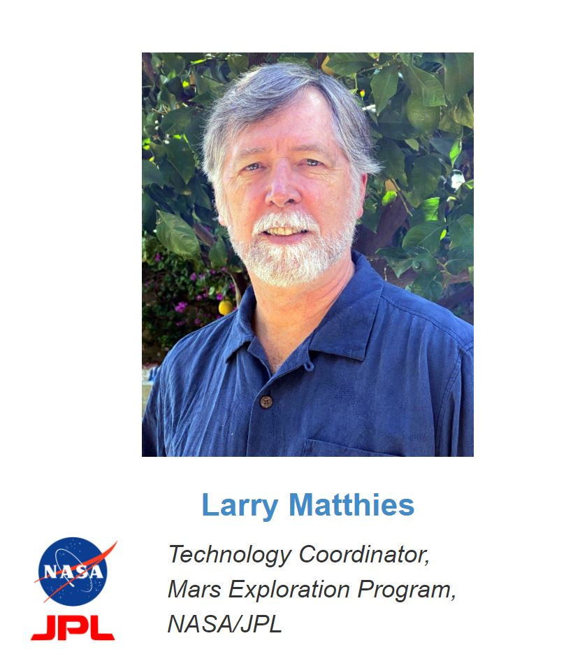
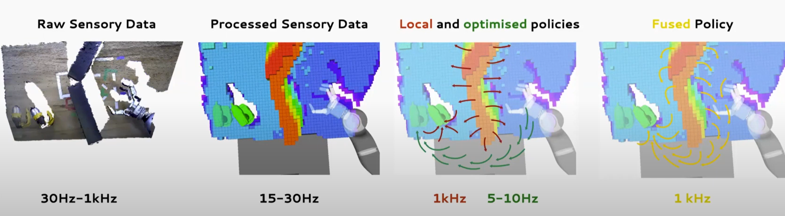
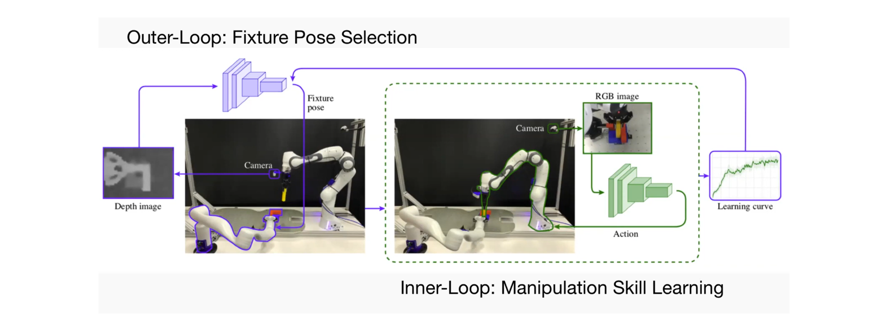
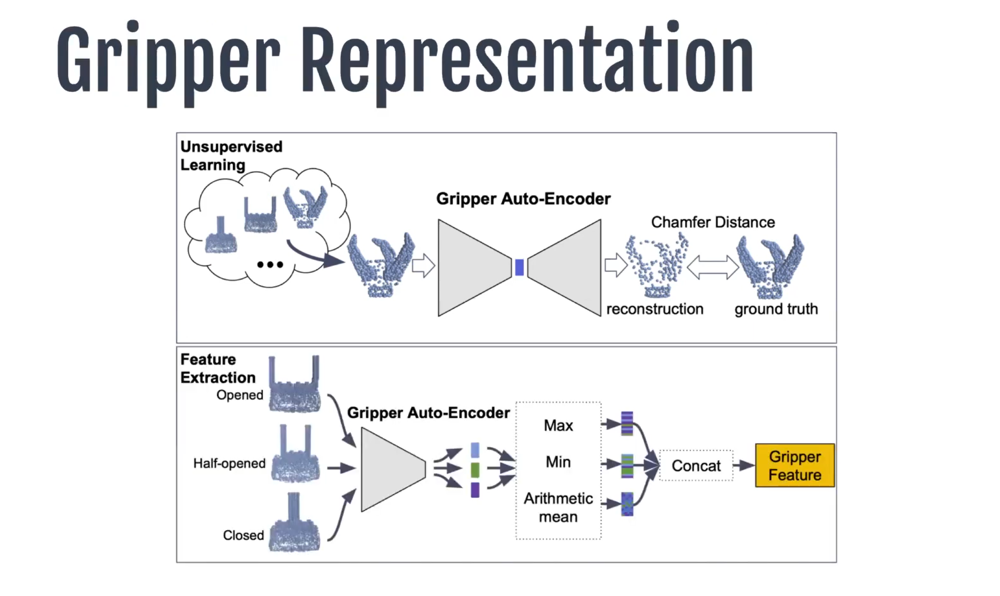
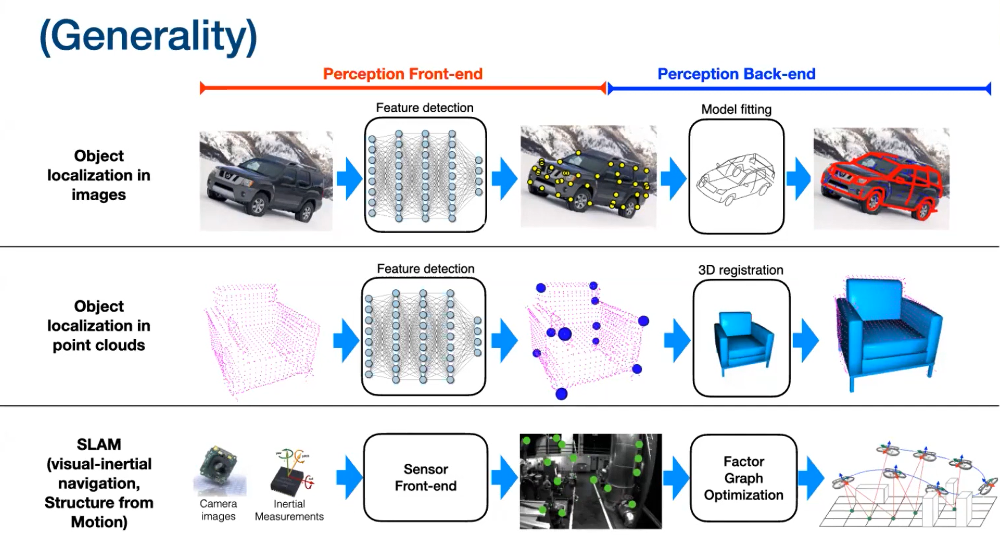
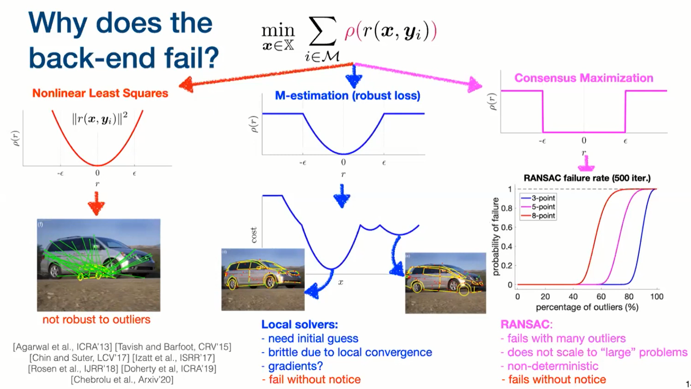
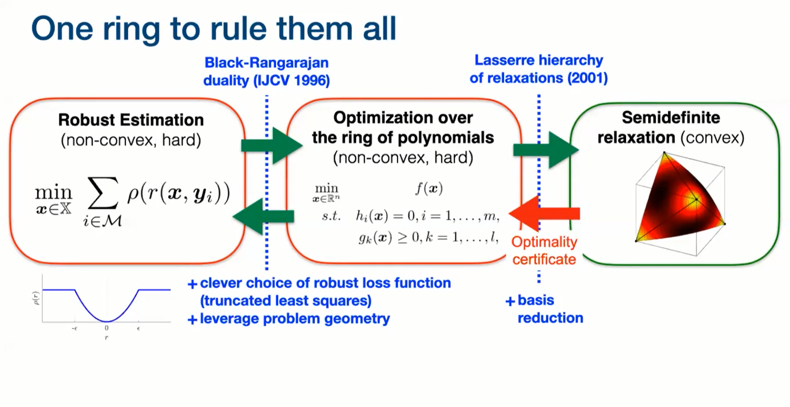
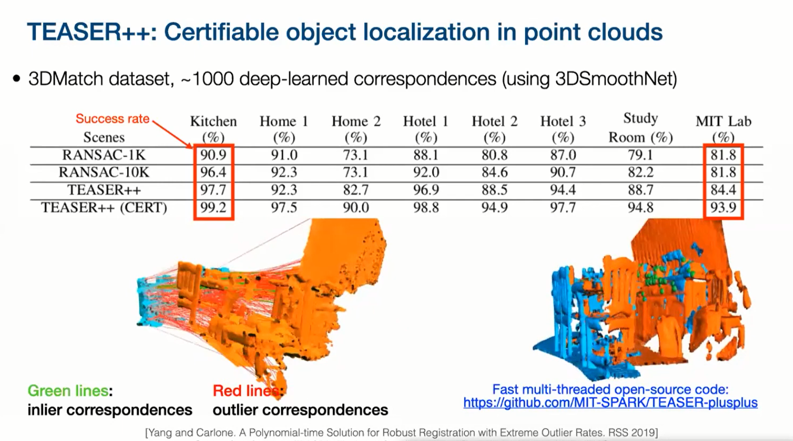

# Inclusion@[RSS](https://roboticsconference.org/) 2021 Fellow | Robotics Science & Systems
I received Inclusion@RSS Fellowship [[44 Fellows list](https://sites.google.com/andrew.cmu.edu/inclusion-2021/directory)] | [RSS in YouTube](https://www.youtube.com/channel/UCeEbAUGjtBlzmqWO5u6VeGg)

  

## Keynote: 
Robotic Mars Exploration: Recent Results and Future Prospects [[keynote](https://roboticsconference.org/program/keynote1/)]

## Workshops & Tutorials @ RSS 2021
I am interested and taking notes of the following workshops at RSS 2021:
- Integrating Planning and Learning [[website](https://planandlearn.net/)]
- Advancing Artificial Intelligence and Manipulation for Robotics: Understanding Gaps, Industry and Academic Perspectives,and Community Building [[website](https://sites.google.com/view/rss-ai-manipulationperspective/home)]
- Declarative and Neurosymbolic Representations in Robot Learning and Control [[website](https://dnr-rob.github.io/)]
- Geometry and Topology in Robotics: Learning, Optimization, Planning, and Control [[website](https://sites.google.com/view/geotopo-rss2021/home)]

## Papers @ RSS 2021
My top 12 papers from RSS 2021:

- Manipulator-Independent Representations for Visual Imitation [[paper](http://www.roboticsproceedings.org/rss17/p002.pdf)] by DeepMind.  
- Optimal Pose and Shape Estimation for Category-level 3D Object Perception [[paper](http://www.roboticsproceedings.org/rss17/p025.pdf)] by MIT.
- Policy Transfer across Visual and Dynamics Domain Gaps via Iterative Grounding [[paper](http://www.roboticsproceedings.org/rss17/p006.pdf)] by USC  
- An Empowerment-based Solution to Robotic Manipulation Tasks with Sparse Rewards [[paper](http://www.roboticsproceedings.org/rss17/p001.pdf)] by MIT  
- Learning Generalizable Robotic Reward Functions from “In-The-Wild” Human Videos [[paper](http://www.roboticsproceedings.org/rss17/p012.pdf)] by Stanford University.
- Untangling Dense Non-Planar Knots by Learning Manipulation Features and Recovery Policies [[paper](http://www.roboticsproceedings.org/rss17/p013.pdf)] by UC Berkeley.
- TARE: A Hierarchical Framework for Efficiently Exploring Complex 3D Environments [[paper](http://www.roboticsproceedings.org/rss17/p018.pdf)] by CMU.
- STEP: Stochastic Traversability Evaluation and Planning for Risk-Aware Off-road Navigation [[paper](http://www.roboticsproceedings.org/rss17/p021.pdf)] by GTech, NASA-JPL, Caltech.
- Language Conditioned Imitation Learning Over Unstructured Data [[paper](http://www.roboticsproceedings.org/rss17/p047.pdf)] by Google.
- HJB-RL: Initializing Reinforcement Learning with Optimal Control Policies Applied to Autonomous Drone Racing [[paper](http://www.roboticsproceedings.org/rss17/p062.pdf)] by Stanford University.
- Learning Riemannian Manifolds for Geodesic Motion Skills [[paper](http://www.roboticsproceedings.org/rss17/p082.pdf)] by Bosch.
- Safe Occlusion-Aware Autonomous Driving via Game-Theoretic Active Perception [[paper](http://www.roboticsproceedings.org/rss17/p066.pdf)] by Princeton University.

My Mentors: [Kaushik Jayaram](https://www.colorado.edu/mechanical/kaushik-jayaram), [Aaron M. Johnson](https://www.andrew.cmu.edu/user/amj1/), [Jeannette Bohg](https://web.stanford.edu/~bohg/), [C. J. Taylor](https://www.cis.upenn.edu/~cjtaylor/home.html), [Nick Roy](https://www.csail.mit.edu/person/nicholas-roy).

 

 

## RSS 2020 Learning:

- RSS 2020, Early Career Award Keynote + Q&A: Jeannette Bohg (Stanford University) [[Video](https://youtu.be/yD_0lUYo5fI)]  
<small>Robotic Grasping of Novel Objects [[NeurIPS 2016](https://papers.nips.cc/paper/2006/hash/22722a343513ed45f14905eb07621686-Abstract.html)] DB for Supervised Learning (SVM) etc to find a good grasping point per pixel. Prof Jeanette made this contribution [ [Learning grasping points with shape context](https://www.sciencedirect.com/science/article/abs/pii/S0921889009001699) ] with feature engineering (edge features & shape context [orientation etc]). From 2D grasping points to 6D grasping pose. Current works [ [Google Arm Farm](https://ai.googleblog.com/2016/03/deep-learning-for-robots-learning-from.html), [DexNet](https://berkeleyautomation.github.io/dex-net/) ]. Insights by Prof Jeannette - Open loop does not work, avoiding collision is constraining, 2D grasping points are not enough. So Continuos Feedback & Re-Planning is important, Exploit the environment, action representations matter. [Real-time Perception meets Reactive Motion Generation](https://arxiv.org/abs/1703.03512), [Probabilistic Articulated Real-Time Tracking for Robot Manipulation](https://arxiv.org/abs/1610.04871) and [Riemannian Motion Policies](https://arxiv.org/abs/1801.02854) were important updates. </small>   
  
<small> More works on Robots actually learning with contact constraints: [Planar in-hand manipulation via motion cones](https://journals.sagepub.com/doi/full/10.1177/0278364919880257), [A novel type of compliant and underactuated robotic hand for dexterous grasping](https://journals.sagepub.com/doi/abs/10.1177/0278364915592961), [An autonomous manipulation system based on force control and optimization](https://link.springer.com/article/10.1007/s10514-013-9365-9) etc.
Q Learning (DoubleQ) in Outer loop and model free RL (A3C) is used in the Inner loop. </small>  
  
<small>Output: [Learning to Scaffold the Development of Robotic Manipulation Skills](https://arxiv.org/abs/1911.00969). Prof Jeannette also learned that grasping depends both upon the object and the fingers - [UniGrasp: Learning a Unified Model to Grasp with Multifingered Robotic Hands](https://arxiv.org/abs/1910.10900). Input : Object Point Cloud and Hand Specification to compute contact points.</small>    
  
<small><b>What's Next ? </b> [Making Sense of Vision and Touch: Self-Supervised Learning of Multimodal Representations for Contact-Rich Tasks](https://arxiv.org/abs/1810.10191), [Concept2Robot: Learning Manipulation Concepts from Instructions and Human Demonstrations](https://sites.google.com/view/concept2robot), [Object-Centric Task and Motion Planning in Dynamic Environments](https://arxiv.org/abs/1911.04679), [Self-Supervised Learning of State Estimation for Manipulating Deformable Linear Objects](https://arxiv.org/abs/1911.06283) and [Dynamic Multi-Robot Task Allocation under Uncertainty and Temporal Constraints](https://arxiv.org/abs/2005.13109).  
Inspiring lines: You cannot learn everything by reading papers, you have to make mistakes and fail. Work on fixture optimization and virtual fixtures are to be done.</small>

- RSS 2020, Early Career Award Keynote + Q&A: Luca Carlone (MIT) [[Video](https://youtu.be/nfZGSMb01Yo)] 
<small><b>Topic :: The Future of Robot Perception : Certifiable Algorithms and Real-time High-level Understanding.</b> Luca is the Director of [Spark Lab, MIT](http://web.mit.edu/sparklab/) : Sensing Perception Autonomy and Robot Kinetics. Saprk Lab mostly works on Robust Perception, Localization and Mapping (Lidar-based SLAM & Certifiable Algorithms); High level scene understanding (Spatial AI) - Kimera: Metrics-Semantic SLAM [[ 3D Dynamic Scene Graphs: Actionable Spatial Perception with Places, Objects, and Humans ](https://arxiv.org/abs/2002.06289) - [3D Scene Understanding RSS'20](https://youtu.be/nDmkjt6aU2Y) ].
<b>Spatial Perception :</b> Using sensor data into an internal model that the robot can use. Luca's work include [One Ring to Rule Them All: Certifiably Robust Geometric Perception with Outliers](https://arxiv.org/abs/2006.06769), [Monitoring and Diagnosability of Perception Systems](https://arxiv.org/abs/2005.11816) etc. 
<b>Key Takeaways from this talk :</b> In order to get low failure rates (e.g < 1e-7) and performance gaurantees, we need to rethink current perception algorithms [Certifiable Perception Algorithms]. We need a theory of robust spatial perception: how to connect robust algorithms into a robust system?   
  
Image-based object localization: perception issues. ISSUE 1: front-end (hand-crafted or deep learned) can fail in unexpected ways (not uncommon to have >90% outlier). ISSUE 2: back-end may fail if there are many outliers. 
<b>Why does the  back-end fail?</b> Back-end at the end of teh day is solving an optimization problem.  
  
In Certifiable Algorithms, we have an input ( measurement yi ) → Optimization Algorithm → Output (estimate). Certifiable Algorithms are fast (i.e Polynomial Time) algorithms that solve outlier rejection to optimality in virtually all problem instances or detect failures in worst case problems. From RANSAC, Luca is trying to flatten the curve. The idea is to transform Robust Estimation (non-convex, hard) problem to Semidefinite (convex) problems solvable in polynomial time using [Black-Rangarajan duality : On the Unification of Line Processes, Outlier Rejection, and Robust Statistics with Applications in Early Vision ](https://www.cise.ufl.edu/~anand/pdf/ijcv.pdf) and [Lasserre hierarchy of relaxations : Global Optimization with Polynomials and the Problem of Moments](https://epubs.siam.org/doi/abs/10.1137/S1052623400366802?mobileUi=0&).
  
  
The rate of success with TEASER++: fast & certifiable 3D registration [[github](https://github.com/MIT-SPARK/TEASER-plusplus)] [[YouTube](https://youtu.be/uwNdLdRozeA)] is way too high. [In Perfect Shape: Certifiably Optimal 3D Shape Reconstruction from 2D Landmarks](https://arxiv.org/abs/1911.11924) is LUCA's another amazing work.
  
  
Robust perception requires high level 3D understanding and 2D segmentation such as MASK-RCNN fails. Solution: [Kimera: an Open-Source Library for Real-Time Metric-Semantic Localization and Mapping](https://arxiv.org/abs/1910.02490) and [Kimera: from SLAM to Spatial Perception with 3D Dynamic Scene Graphs](https://arxiv.org/abs/2101.06894). Kimera [[github](https://github.com/MIT-SPARK/Kimera)] can output real-time 3D model of the environment.
  
  
<b>3D Dynamic Scene Graph : [ 3D Dynamic Scene Graphs: Actionable Spatial Perception with Places, Objects, and Humans ](https://arxiv.org/abs/2002.06289)</b> Transition from SLAM algorithms to a notion of spatial perception where we cn segment layers spatially of an environment.
<b>REFERENCES : </b> 
<b>Certifiably Robust Perception Algorithms and Systems : </b> 
    + [One Ring to Rule Them All: Certifiably Robust Geometric Perception with Outliers](https://arxiv.org/abs/2006.06769)   
    + [Monitoring and Diagnosability of Perception Systems](https://arxiv.org/abs/2005.11816)  
    + [TEASER: Fast and Certifiable Point Cloud Registration](https://arxiv.org/abs/2001.07715)  
    + [Graduated Non-Convexity for Robust Spatial Perception: From Non-Minimal Solvers to Global Outlier Rejection](https://arxiv.org/abs/1909.08605)  
    + [In Perfect Shape: Certifiably Optimal 3D Shape Reconstruction from 2D Landmarks](https://arxiv.org/abs/1911.11924)  
    + [A Polynomial-time Solution for Robust Registration with Extreme Outlier Rates](https://arxiv.org/abs/1903.08588)  
    + [A Quaternion-based Certifiably Optimal Solution to the Wahba Problem with Outliers](https://arxiv.org/abs/1905.12536)  
    + [Outlier-Robust Spatial Perception: Hardness, General-Purpose Algorithms, and Guarantees](https://arxiv.org/abs/1903.11683)  
    + [Modeling Perceptual Aliasing in SLAM via Discrete-Continuous Graphical Models](https://arxiv.org/abs/1810.11692)  

    <b>High-level Understanding - 3D Dynamic Scene Graphs and Kimera : </b> 
    + [3D Dynamic Scene Graphs: Actionable Spatial Perception with Places, Objects, and Humans ](https://arxiv.org/abs/2002.06289)  
    + [Kimera: an Open-Source Library for Real-Time Metric-Semantic Localization and Mapping](https://arxiv.org/abs/1910.02490)  
</small>

- RSS2020, Test of Time: Award Talk + Q&A + Panel Debate [ [ Video ](https://youtu.be/QgpmMn9K5Eo)]  
From Square Root SAM to GTSAM: Factor Graphs in Robotics [[website](https://dellaert.github.io/talks/Test-of-Time)] 
<small>[Skydio Drones](https://www.skydio.com/) : The autonomy stack has to support superior navigation,tracking, and motion planning at a very low power. Using sparse SLAM we build a world representation around us. Many of these are optimization problems which are well solved by Factor Graphs. Factor graphs can represent many robotics problems from tracking to optimal control to sophisticated 3D mapping. Factor Graph exposes opportunities for raw field because of the deep connection with sparse linear algebra - Ordering Heuristics, Nested Dissection, Sparsification, Pre-Integration, Iterative Solvers, Incremental Inference and the Bayes Tree. So it gives oppportunities to increase computational performance.  
<b>SAM to GTSAM :</b> 
Smoothing and Mapping (SAM) : [[ Square Root SAM: Simultaneous Localization and Mapping via Square Root Information Smoothing ](https://journals.sagepub.com/doi/10.1177/0278364906072768)]
 
<b>Navigation and Mapping : </b>  
[[ iSAM: Incremental Smoothing and Mapping ](https://ieeexplore.ieee.org/document/4682731)] is used for mapping aircraft carriers to underwater robotics. Pre-Integrating IMU measurements yields state of the art visual-inertial navigation. 
<b>Future :</b> 
Kimera from Luca's lab uses Factor Graphs. 'Dynamic Scene Graph' uses Factor graph as well. Factor Graph Applications :  [DeepFactors: Real-Time Probabilistic Dense Monocular SLAM](https://arxiv.org/abs/2001.05049), [Hybrid Contact Preintegration for Visual-Inertial-Contact State Estimation Using Factor Graphs](https://arxiv.org/abs/1803.07531), [Robust Legged Robot State Estimation Using Factor Graph Optimization](https://www.robots.ox.ac.uk/~mobile/drs/Papers/2019RAL_wisth.pdf), [Motion Planning as Probabilistic Inference using Gaussian Processes and Factor Graphs](http://www.roboticsproceedings.org/rss12/p01.pdf), [Batch and Incremental Kinodynamic Motion Planning using Dynamic Factor Graphs](https://arxiv.org/abs/2005.12514), [A Nonparametric Belief Solution to the Bayes Tree](https://www.ri.cmu.edu/pub_files/2016/10/Fourie16iros.pdf), [Bundle Adjustment on a Graph Processor](https://arxiv.org/abs/2003.03134). 

</small>
