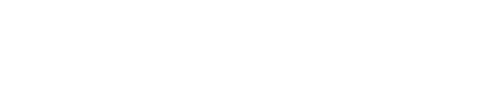
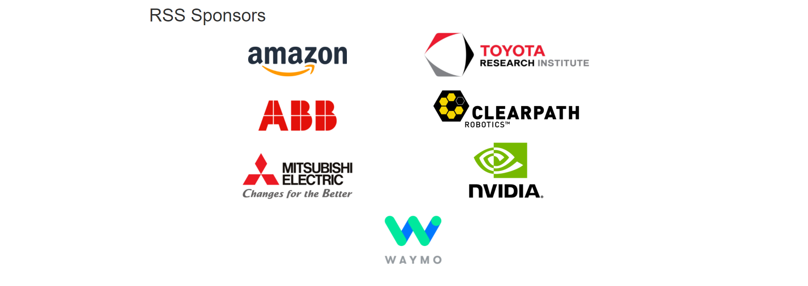

# Inclusion@[RSS](https://roboticsconference.org/) 2021 Fellow | Robotics Science & Systems
I received Inclusion@RSS Fellowship [[44 Fellows list](https://sites.google.com/andrew.cmu.edu/inclusion-2021/directory)] | [RSS in YouTube](https://www.youtube.com/channel/UCeEbAUGjtBlzmqWO5u6VeGg)

  

## Keynote: 
Robotic Mars Exploration: Recent Results and Future Prospects [[keynote](https://roboticsconference.org/program/keynote1/)]

## Workshops & Tutorials @ RSS 2021
I am interested and taking notes of the following workshops at RSS 2021:
- Integrating Planning and Learning [[website](https://planandlearn.net/)]
- Advancing Artificial Intelligence and Manipulation for Robotics: Understanding Gaps, Industry and Academic Perspectives,and Community Building [[website](https://sites.google.com/view/rss-ai-manipulationperspective/home)]
- Declarative and Neurosymbolic Representations in Robot Learning and Control [[website](https://dnr-rob.github.io/)]
- Geometry and Topology in Robotics: Learning, Optimization, Planning, and Control [[website](https://sites.google.com/view/geotopo-rss2021/home)]

## Papers @ RSS 2021
My top 12 papers from RSS 2021:

- Manipulator-Independent Representations for Visual Imitation [[paper](http://www.roboticsproceedings.org/rss17/p002.pdf)] by DeepMind.  
- Optimal Pose and Shape Estimation for Category-level 3D Object Perception [[paper](http://www.roboticsproceedings.org/rss17/p025.pdf)] by MIT.
- Policy Transfer across Visual and Dynamics Domain Gaps via Iterative Grounding [[paper](http://www.roboticsproceedings.org/rss17/p006.pdf)] by USC  
- An Empowerment-based Solution to Robotic Manipulation Tasks with Sparse Rewards [[paper](http://www.roboticsproceedings.org/rss17/p001.pdf)] by MIT  
- Learning Generalizable Robotic Reward Functions from “In-The-Wild” Human Videos [[paper](http://www.roboticsproceedings.org/rss17/p012.pdf)] by Stanford University.
- Untangling Dense Non-Planar Knots by Learning Manipulation Features and Recovery Policies [[paper](http://www.roboticsproceedings.org/rss17/p013.pdf)] by UC Berkeley.
- TARE: A Hierarchical Framework for Efficiently Exploring Complex 3D Environments [[paper](http://www.roboticsproceedings.org/rss17/p018.pdf)] by CMU.
- STEP: Stochastic Traversability Evaluation and Planning for Risk-Aware Off-road Navigation [[paper](http://www.roboticsproceedings.org/rss17/p021.pdf)] by GTech, NASA-JPL, Caltech.
- Language Conditioned Imitation Learning Over Unstructured Data [[paper](http://www.roboticsproceedings.org/rss17/p047.pdf)] by Google.
- HJB-RL: Initializing Reinforcement Learning with Optimal Control Policies Applied to Autonomous Drone Racing [[paper](http://www.roboticsproceedings.org/rss17/p062.pdf)] by Stanford University.
- Learning Riemannian Manifolds for Geodesic Motion Skills [[paper](http://www.roboticsproceedings.org/rss17/p082.pdf)] by Bosch.
- Safe Occlusion-Aware Autonomous Driving via Game-Theoretic Active Perception [[paper](http://www.roboticsproceedings.org/rss17/p066.pdf)] by Princeton University.

My Mentors: [Kaushik Jayaram](https://www.colorado.edu/mechanical/kaushik-jayaram), [Aaron M. Johnson](https://www.andrew.cmu.edu/user/amj1/), [Jeannette Bohg](https://web.stanford.edu/~bohg/), [C. J. Taylor](https://www.cis.upenn.edu/~cjtaylor/home.html), [Nick Roy](https://www.csail.mit.edu/person/nicholas-roy).

 

 

RSS 2020 Learning:

- RSS 2020, Early Career Award Keynote + Q&A: Jeannette Bohg [[Video](https://youtu.be/yD_0lUYo5fI)]  
<small>Robotic Grasping of Novel Objects [[NeurIPS 2016](https://papers.nips.cc/paper/2006/hash/22722a343513ed45f14905eb07621686-Abstract.html)] DB for Supervised Learning (SVM) etc to find a good grasping point per pixel. Prof Jeanette made this contribution [ [Learning grasping points with shape context](https://www.sciencedirect.com/science/article/abs/pii/S0921889009001699) ] with feature engineering (edge features & shape context [orientation etc]). From 2D grasping points to 6D grasping pose. Current works [ [Google Arm Farm](https://ai.googleblog.com/2016/03/deep-learning-for-robots-learning-from.html), [DexNet](https://berkeleyautomation.github.io/dex-net/) ]. Insights by Prof Jeannette - Open loop does not work, avoiding collision is constraining, 2D grasping points are not enough. So Continuos Feedback & Re-Planning is important, Exploit the environment, action representations matter. [Real-time Perception meets Reactive Motion Generation](https://arxiv.org/abs/1703.03512), [Probabilistic Articulated Real-Time Tracking for Robot Manipulation](https://arxiv.org/abs/1610.04871) and [Riemannian Motion Policies](https://arxiv.org/abs/1801.02854) were important updates. </small>   
  
<small> More works on Robots actually learning with contact constraints: [Planar in-hand manipulation via motion cones](https://journals.sagepub.com/doi/full/10.1177/0278364919880257), [A novel type of compliant and underactuated robotic hand for dexterous grasping](https://journals.sagepub.com/doi/abs/10.1177/0278364915592961), [An autonomous manipulation system based on force control and optimization](https://link.springer.com/article/10.1007/s10514-013-9365-9) etc.
Q Learning (DoubleQ) in Outer loop and model free RL (A3C) is used in the Inner loop. </small>  
  
<small>Output: [Learning to Scaffold the Development of Robotic Manipulation Skills](https://arxiv.org/abs/1911.00969). Prof Jeannette also learned that grasping depends both upon the object and the fingers - [UniGrasp: Learning a Unified Model to Grasp with Multifingered Robotic Hands](https://arxiv.org/abs/1910.10900). Input : Object Point Cloud and Hand Specification to compute contact points.</small>    
  
<small><b>What's Next ? </b> [Making Sense of Vision and Touch: Self-Supervised Learning of Multimodal Representations for Contact-Rich Tasks](https://arxiv.org/abs/1810.10191), [Concept2Robot: Learning Manipulation Concepts from Instructions and Human Demonstrations](https://sites.google.com/view/concept2robot), [Object-Centric Task and Motion Planning in Dynamic Environments](https://arxiv.org/abs/1911.04679), [Self-Supervised Learning of State Estimation for Manipulating Deformable Linear Objects](https://arxiv.org/abs/1911.06283) and [Dynamic Multi-Robot Task Allocation under Uncertainty and Temporal Constraints](https://arxiv.org/abs/2005.13109).  
Inspiring lines: You cannot learn everything by reading papers, you have to make mistakes and fail. Work on fixture optimization and virtual fixtures are to be done.</small>

- RSS 2020, Early Career Award Keynote + Q&A: Luca Carlone [[Video](https://youtu.be/nfZGSMb01Yo)]

- RSS2020, Test of Time: Award Talk + Q&A + Panel Debate [ [ Video ](https://youtu.be/QgpmMn9K5Eo)]  
From Square Root SAM to GTSAM: Factor Graphs in Robotics [[website](https://dellaert.github.io/talks/Test-of-Time)]