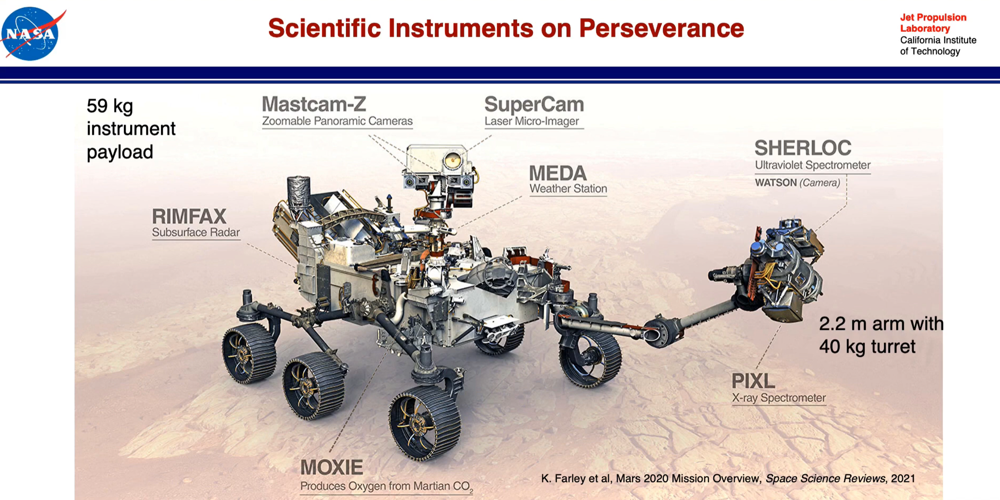
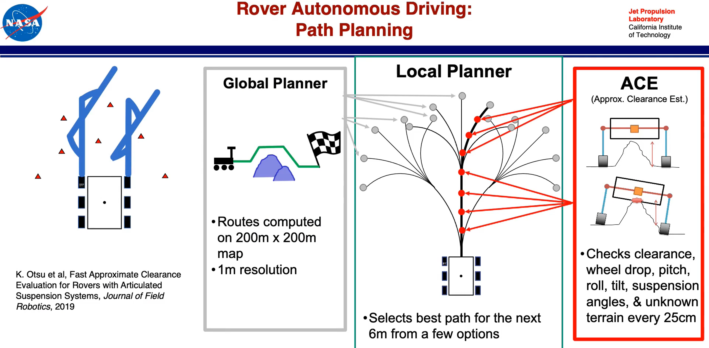
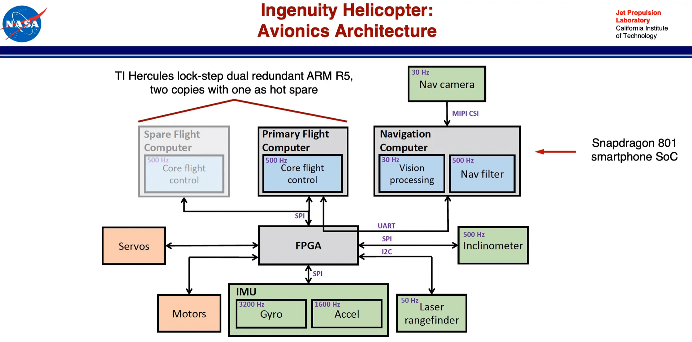

# [Keynote](https://youtu.be/E7rEO2BtBCg) @ RSS 2021 | Larry Matthies (NASA-JPL)
## Robotic Mars Exploration: Recent Results and Future Prospects

 
 &nbsp; &nbsp;&nbsp;&nbsp;&nbsp;

<b>What's new?</b>  
- More Scientific instruments to search for signs of ancient microbial life.
- Sample Acquisition and Caching subsystem as the first step towards eventual sample return.
- More precise landing than ever before, with Terrain Relative Navigation (TRN) to avoid landing hazards mapped from orbit.
- Much faster rover traverse than before, enabled by a FPGA coprocessor for vision algorithms and a smarter path planning algorithm.
- Technology demonstration, 'Ingenuity Helicopter', the first ever heavier-than-air aircraft to fly on another planet.  
 
### Papers :
+ [ The Sampling and Caching Subsystem (SCS) for the Scientific Exploration of Jezero Crater by the Mars 2020 Perseverance Rover ](https://link.springer.com/article/10.1007/s11214-020-00783-7) 
+ [In-flight experience of the Mars Science Laboratory Guidance, Navigation, and Control system for Entry, Descent, and Landing](https://link.springer.com/article/10.1007/s12567-015-0091-3) 
+ [Mars 2020 Entry, Descent, and Landing System Overview](https://ieeexplore.ieee.org/document/8742167%20/authors#authors) 
+ [THE LANDER VISION SYSTEM FOR MARS 2020
ENTRY DESCENT AND LANDING](https://trs.jpl.nasa.gov/bitstream/handle/2014/46186/CL%2317-0445.pdf?isAllowed=y&sequence=1)
+ [Enabling continuous planetary rover navigation through FPGA stereo and visual odometry](https://ieeexplore.ieee.org/abstract/document/6187041) 
+ [Fast Approximate Clearance Evaluation for Rovers with Articulated Suspension Systems](https://arxiv.org/abs/1808.00031) 
+ [Mars Helicopter Technology Demonstrator](https://rotorcraft.arc.nasa.gov/Publications/files/Balaram_AIAA2018_0023.pdf)  
 
 
### Papers:
Ingenuity has SnapDragon processor.  
- [Vision-Based Navigation for the NASA Mars Helicopter](https://arc.aiaa.org/doi/abs/10.2514/6.2019-1411)
- [Flight Control System for NASA's Mars Helicopter](https://arc.aiaa.org/doi/10.2514/6.2019-1289)

