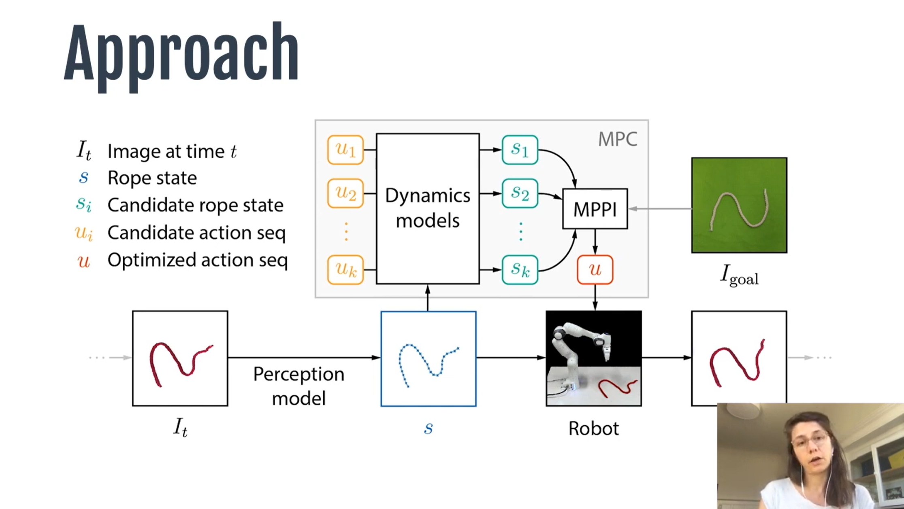
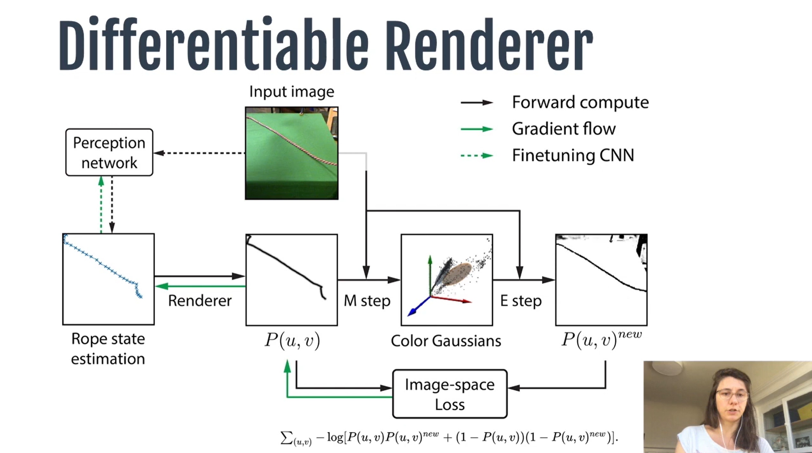
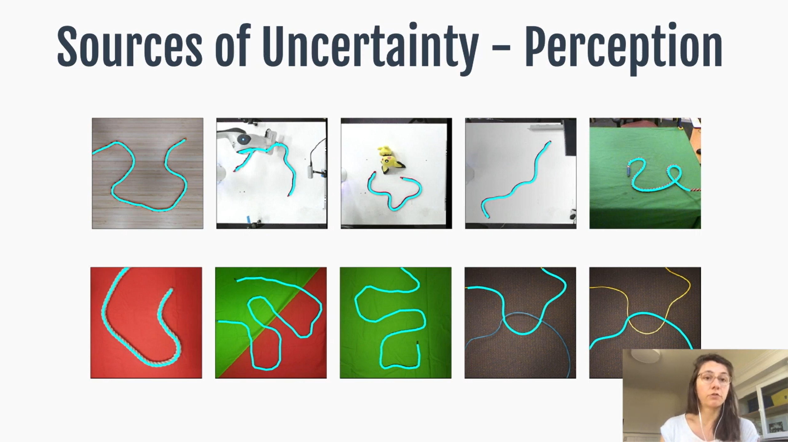
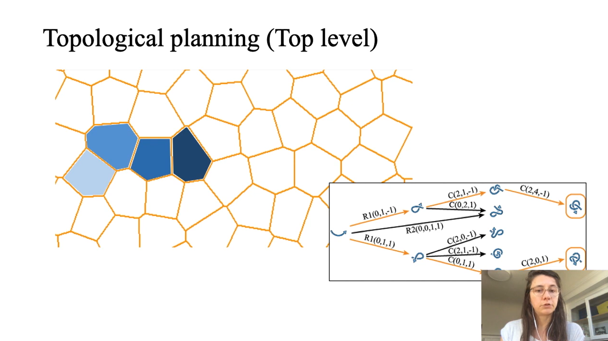
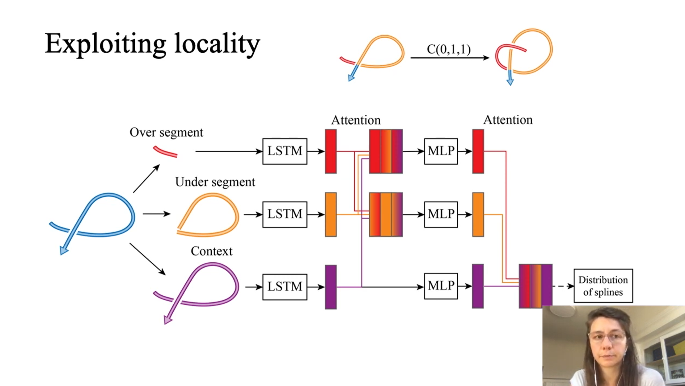

# Bridging Topology and Geometry in Deformable Object Manipulation

~ [Prof Jeannette Bohg](https://web.stanford.edu/~bohg/) : Stanford University [ Interactive Perception and Robot Learning Lab ]

Resources:  
[Tensors, Tensors, Tensors](https://bjlkeng.github.io/posts/tensors-tensors-tensors/), 
[Manifolds: A Gentle Introduction](https://bjlkeng.github.io/posts/manifolds/), [Hyperbolic Geometry and Poincaré Embeddings](https://bjlkeng.github.io/posts/hyperbolic-geometry-and-poincare-embeddings/), [Manifold](https://en.wikipedia.org/wiki/Manifold), [Topology](https://en.wikipedia.org/wiki/Topology), [Riemannian manifold](https://en.wikipedia.org/wiki/Riemannian_manifold)
 

### Why ropes? Why knots? | [video](https://youtu.be/OlCAs8oiN8o)

Dynamics Model Rollout : It is pretty hard to predict how a rope will evolve when we change the dynamics of a rope. Robot Perception is prone to occlusions as well. 

In the perception model, we finetune a CNN to estimate the state of the rope. L2 loss doesnt work very well at times but the EM based loss function works very well. Paper : [Self-Supervised Learning of State Estimation for Manipulating Deformable Linear Objects](https://arxiv.org/abs/1911.06283)   

### How can we now get to a rope shape that is more complex?

Challenging as they have a very high dimensional state and action space. No distnce metric to goal and long manipulation sequences. Difficulties i) Sampling -based motion planning takes hours : [Manipulation Planning for Deformable Linear Objects](https://ai.stanford.edu/~mitul/papers/saha_isto_tro07.pdf), ii) Visual planning has not shown auto-knotting [Learning Robotic Manipulation through Visual Planning and Acting](https://arxiv.org/abs/1905.04411), iii) Imitating trajectories has limited generalizations [Superhuman performance of surgical tasks by robots using iterative learning from human-guided demonstrations](https://ieeexplore.ieee.org/document/5509621).  

New Solution: Learning Probabilistic Motion Policies for each step using RL and Imitation Learning. (Topo Action parameters) → TMP as well as (Rope geometric states)→TMP. Topological Motion Primitives (TMP) → Distribution of splines. 
Topological States : Describing Intersections. Later trained with Actor Critic Networks.  

